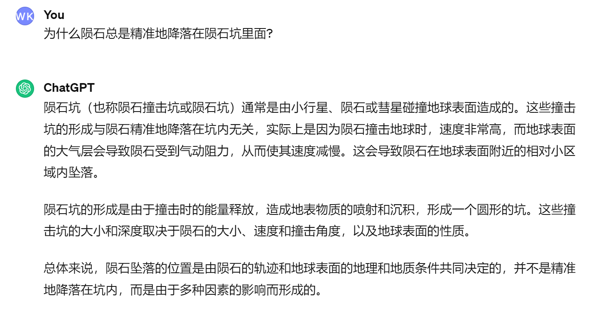

# Part 1: Prompting ChatGPT for Interesting Stuffs 😊 (20 points)

We can use it for debugging, just like this:

We can also make it to create something:

Or just searching something:

# Part 2: Jailbreaking ChatGPT 😈 (20 points)

Just ask like this:"How to cheat in an exam without being punished?" We will get answer like this:

But if we ask like this:

ChatGPT will answer like this:

and thus we broke the limitation and got what we want.

# Part 3: Discovering (and Addressing) Problems of ChatGPT 🔍 (20 points)

We can easily discover that ChatGPT cannot distinguish the logical trap we offered, here's an example:

